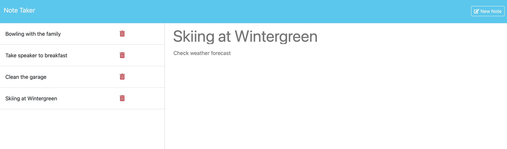
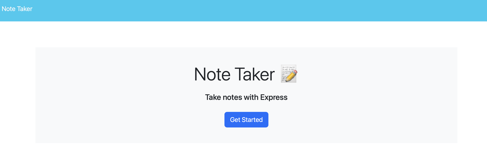

# Note Taker

## Description
This is a simple note-taking app. Notes can be viewed, added and deleted as shown in the screenshot below.

Note that I wrote the back-end code; the front-end HTML, CSS, and JS files were supplied by the Coding Bootcamp.

## Installation and Use
The app has been deployed to [Heroku](https://intense-savannah-87743-ad46dd586406.herokuapp.com). If you wish to run it from your own compute, download or clone the app. Then in the terminal, navigate to the directory and run `npm install` to install the node dependencies. Then run `node server.js` to start a web server on port 3000. Open <http://localhost:3000> on a web browser to start the application. The home screen is shown in the screenshot below; click the button to review, add, or delete notes.

## Questions
Reach out if you have questions that are not covered here!

- GitHub username: clstevenson
- email: chrislstevenson@gmail.com

